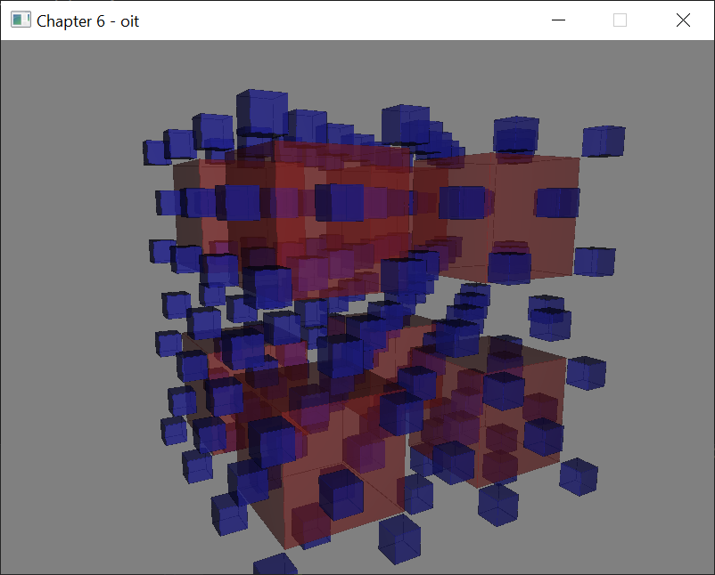

# Image Processing and Screen Space Techniques

As I read this book, I summarize what I think is wrong. If you think my comments are wrong then please let me know. We can dicuss more and update your opinion.

## OIT(Order Independent Transparency)

We can see the diagonal rendering artifact when we run this example like below.


The reason of this issue is that one face is consist of two triangles. Thus overlapped pixels are added twice. We need to skip blending color value when two depth values are equaled. So if we change a fragment shader like below the diagonal rendering artifact is disapeared.

```
vec4 color = vec4(0.5, 0.5, 0.5, 1.0);

if (count > 0)
{
  color = mix(color, frags[0].color, frags[0].color.a);

  for( int i = 1; i < count; i++ )
  {
    if (abs(frags[i].depth - frags[i-1].depth) > 0.00001)
      color = mix( color, frags[i].color, frags[i].color.a);
  }
}
```

